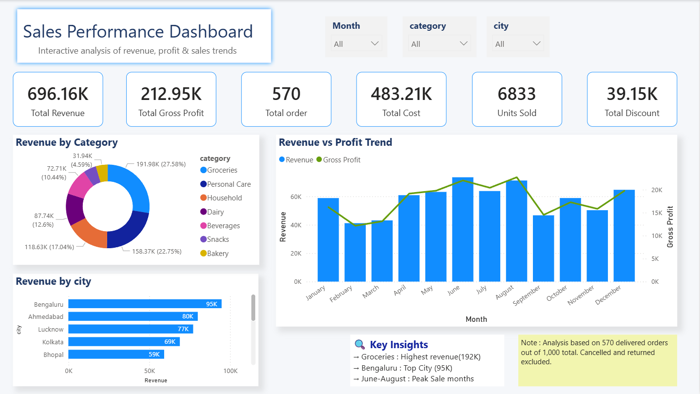
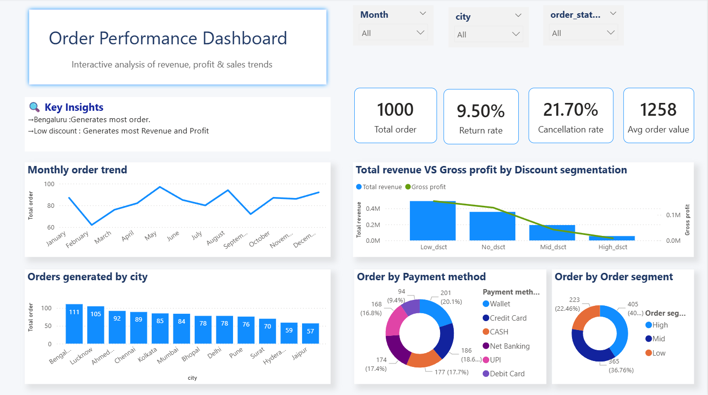
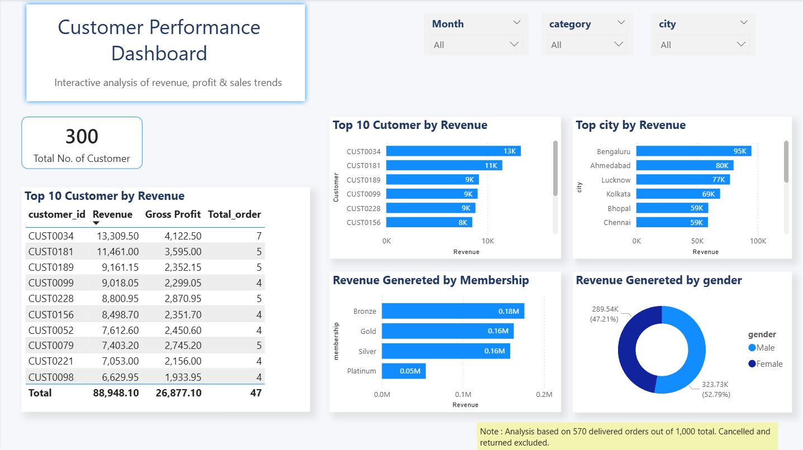
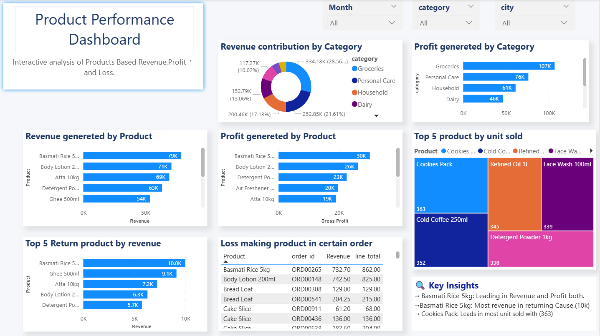

# 🛒 Sales Analytics — End to End Data Project
### Dirty Data → SQL Cleaning → Power BI Dashboard

---

## 📸 Dashboard Preview

### Page 1 — Sales Overview


### Page 2 —Order Analysis


### Page 3 — Customer Analysis


### Page 4 — Product Analysis


## 📌 Project Overview

A real-world simulation of an end-to-end data analytics pipeline for an Indian retail store. Starting from a deliberately messy dataset, this project covers the full lifecycle:

1. **Data Audit** — Finding all issues before touching anything
2. **SQL Cleaning** — 3 layer architecture (Raw → Staging → Business)
3. **Power BI Dashboard** — 4 page interactive dashboard

> **Why this project?** Most portfolios start with clean data. This one doesn't. Every issue — nulls, duplicates, mixed formats, outliers — mirrors what you encounter in real analyst jobs.

---

## 📁 Project Structure

```
sales-analytics/
│
├── data/
│   └── raw/
│       ├── customers_raw.csv
│       ├── products_raw.csv
│       ├── orders_raw.csv
│       └── order_items_raw.csv
│
├── sql/
│   ├── 01_data_audit.sql
│   ├── 02_Clean_table.sql
│   └── 03_fact_sales.sql
│
├── powerbi/
│   └── sales_dashboard.pbix
│
└── README.md
```

---

## 🗃️ Dataset

| Table | Rows | Columns | Description |
|---|---|---|---|
| `customers_raw` | 300 | 10 | Customer details (dirty) |
| `products_raw` | 44 | 8 | Product catalog (dirty) |
| `orders_raw` | 1,050 | 7 | Order records (dirty) |
| `order_items_raw` | 4,594 | 6 | Line items (dirty) |
| **Total** | **5,988** | | |

> Dataset synthetically generated to simulate real-world data quality issues.

---

## 🏗️ 3 Layer Architecture

```
Layer 1 — RAW        → Import CSVs as-is. Never modified.
Layer 2 — STAGING    → All cleaning happens here (4 clean views)
Layer 3 — BUSINESS   → Joins + calculations + flags (fact_sales)
```

---

## 🧨 Data Quality Issues Fixed

### customers_raw
| Issue | Rows | Action |
|---|---|---|
| Null emails | 14 | Set to NULL |
| Invalid emails (no @) | 10 | Set to NULL |
| Null phones | 63 | Set to NULL |
| Invalid phone formats | Multiple | Standardized to 10 digits |
| Gender variants | All rows | Standardized |
| City spelling variants | 49 variants | Standardized |
| Mixed date formats | 3 formats | Converted to YYYY-MM-DD |

### orders_raw
| Issue | Rows | Action |
|---|---|---|
| Duplicate records | 50 | Removed using ROW_NUMBER() |
| Orphan orders | 17 | Removed using INNER JOIN |
| Payment method variants | 11 variants | Standardized |
| Mixed date formats | 5 formats | REGEXP + CASE WHEN |

### order_items_raw
| Issue | Rows | Action |
|---|---|---|
| Duplicate line items | 150 | Removed using ROW_NUMBER() |
| Null unit prices | 229 | Set to NULL |
| Negative prices | 76 | Set to NULL |
| Negative quantities | 73 | ABS() applied |
| Invalid line totals | Multiple | Flagged as Unverified |

---

## 🔧 Key SQL Techniques Used

```sql
-- Duplicate removal
ROW_NUMBER() OVER (PARTITION BY order_id ORDER BY (SELECT NULL))

-- Mixed date formats using REGEXP
CASE
    WHEN date REGEXP '^[0-9]{4}-[0-9]{2}-[0-9]{2}$'
        THEN STR_TO_DATE(date, '%Y-%m-%d')
    WHEN date REGEXP '^[0-9]{2}/[0-9]{2}/[0-9]{4}$'
        THEN STR_TO_DATE(date, '%d/%m/%Y')
END

-- Business calculations
ROUND(line_total * (1 - COALESCE(discount_pct,0)/100), 2) AS Revenue
ROUND((unit_price - cost_price) * quantity, 2) AS Gross_profit
```

---

## 📊 Power BI Dashboard

### Star Schema:
```
Date_Table ──► fact_sales ◄── products_clean
customers ────────┘    └───── orders_clean
```

### 4 Pages:
| Page | Focus | Key Visuals |
|---|---|---|
| Sales Overview | Revenue & Profit | Combo chart, Bar charts, 6 KPIs |
| Product Performance | Product & Category | Donut, Treemap, Tables |
| Customer Analysis | Customer behavior | Top 10 table, Membership, Gender |
| Order Analysis | Order operations | Monthly trend, Payment, Segments |

### Key DAX Measures:
```dax
Return_Rate = 
DIVIDE(
    CALCULATE(DISTINCTCOUNT(Fact_sales[order_id]),
    Fact_sales[order_status] = "Returned"),
    CALCULATE(DISTINCTCOUNT(Fact_sales[order_id]),
    ALL(Fact_sales[order_status]))
)
```

---

## 🔑 Key Findings

- **Groceries** highest revenue category (₹192K — 27% of total)
- **Bengaluru** leads all cities with ₹95K revenue
- **June-July** are peak sales months
- **21.7%** cancellation rate — significant concern
- **Low discount** orders generate highest revenue
- **Cookies Pack** leads in units sold (363 units)

---

## ⚠️ Data Note

Dashboard analysis based on **570 delivered orders** out of 1,000 total.
Cancelled (21.7%) and returned (9.5%) orders excluded from revenue calculations.
See Order Analysis page for complete breakdown.

---

## 🛠️ Tools Used

| Tool | Purpose |
|---|---|
| MySQL Workbench | SQL cleaning & transformation |
| Power BI Desktop | Dashboard & visualization |
| Git & GitHub | Version control |

---

## 👤 About

**[Vikash Sharma]**
Aspiring Data Analyst | SQL • Power BI • Python

- 📧 [vikashsharma20103@gmail.com]
- 💼 [https://www.linkedin.com/in/vikash-sharma-data-analyst/]

---

*Dataset synthetically generated for learning purposes.*
